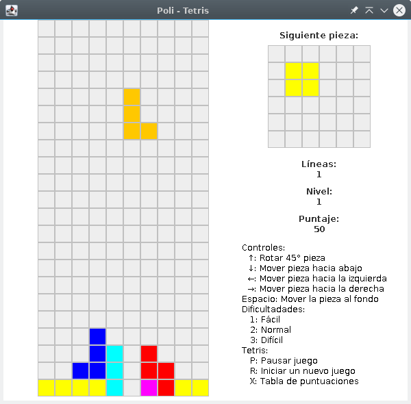

<div align="center">

# Poli - Tetris



</div>

## Iniciar el juego

En Linux ejecutar los comandos por terminal depende de tu versión de java:

### Java 11

```bash
java -jar Tetris-11.jar
```

### Java 17

```bash
java -jar Tetris-17.jar
```

## Controles

La interfaz gráfica no posee ningún botón.
Se han implementado métodos de teclado para jugar el juego como se muestra en la esquina inferior derecha del tetris.

### Movimientos

- ↑: Rotar 45° pieza
- ↓: Mover pieza hacia abajo
- ←: Mover pieza hacia la izquierda
- →: Mover pieza hacia la derecha
- Space: Mover la pieza al fondo

### Cambiar dificultades

- 1: Fácil
- 2: Normal
- 3: Díficil

### Otros

- P: Pausar juego
- R: Iniciar un juego nuevo
- T: Mostrar tabla de puntuaciones
